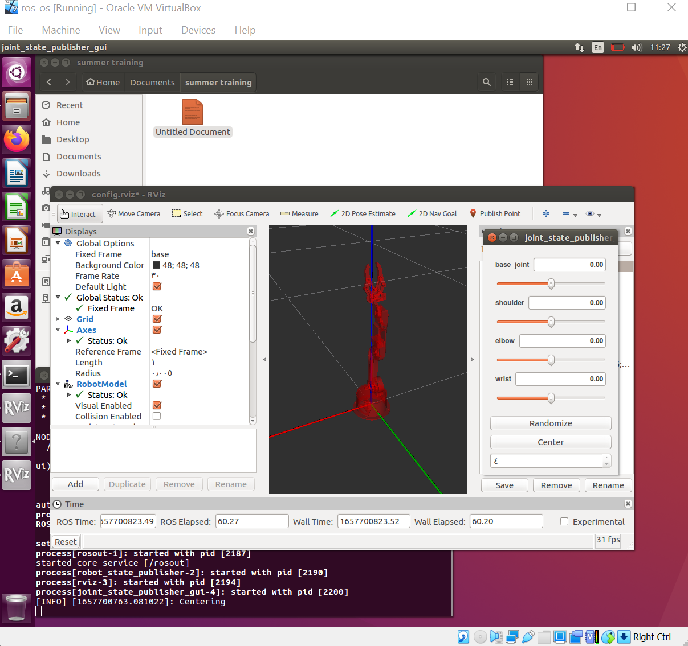

# Installing-Arduino-Robot-Arm

## About This Project  
The robot arm has 5 joints only 4 joints can be fully controlled via ROS and Rviz, the last joint **gripper** has a default motion executed from the Arduino code directly. 
 

## Breadboard View  

 

## Robot initial positions  

## SetUp Arduino Robot Arm🦾:

**○ First thing we login to Ubuntu then open terminal and write those commands :** 

**○ Check the dependencies:** 
`cd ~/catkin_ws/`  

`catkin_make`  

`cd ~/catkin_ws/src`  

`git clone https://github.com/smart-methods/arduino_robot_arm.git`   

`cd ~/catkin_ws`  

`rosdep install --from-paths src --ignore-src -r -y`  

`sudo apt-get install ros-kinetic-moveit`  

`sudo apt-get install ros-kinetic-joint-state-publisher ros-kinetic-joint-state-publisher-gui`  

`sudo apt-get install ros-kinetic-gazebo-ros-control joint-state-publisher`  

`sudo apt-get install ros-kinetic-ros-controllers ros-kinetic-ros-control`  

**○ Now update your `bashrc` script with the information about the new workspace:** 

`sudo nano ~/.bashrc`  

**○ at the end of the `bashrc` file add the follwing line**  
`source /home/wesam/catkin_ws/devel/setup.bash`  
**○ then ctrl + o** 

`source ~/.bashrc` 
**○ The final command to finally launch the Arm** 
`roslaunch robot_arm_pkg check_motors.launch`  

 

## ○ Robot Arm View🔎: 

